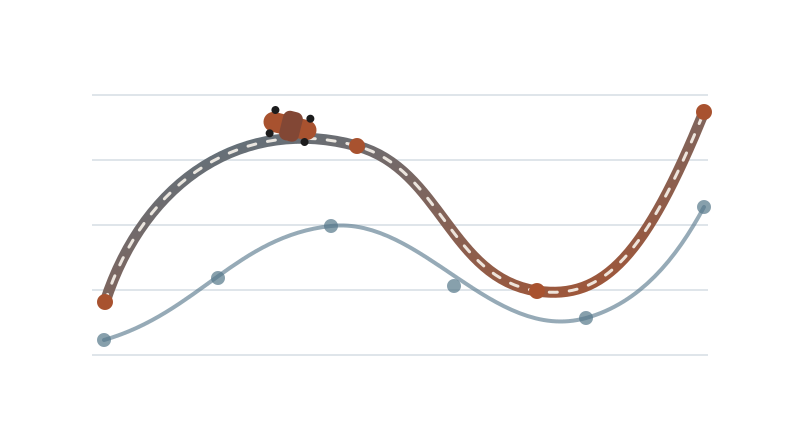

[Astro kitchen sink](/dev/kitchen-sink/) · [Quarto kitchen sink](/dev/quarto-kitchen-sink.html) · [Viewport dashboard](/dev/viewports/)

# Heading level one

The document title and this explicit heading exercise the full Quarto hierarchy.

## Reading structure

This genuine Quarto document checks ordinary prose, [project links](/projects/), **strong emphasis**, *editorial emphasis*, inline code such as `model.fit(data)`, and a footnote.^[Footnotes remain part of the scientific-document workflow.]

> A compact QA document should exercise the real renderer, not imitate it.

1. Formulate the model.
2. Inspect the computation.
3. Communicate the evidence.

- Preserve assumptions.
- Keep technical output reproducible.

---

## Mathematics

The transport distance $W_2(\mu, \nu)$ and a regularised estimator give useful inline checks. The optimisation problem is @eq-objective.

$$
\min_x \; \frac{1}{2}\lVert Ax-b\rVert_2^2 + \lambda R(x).
$$ {#eq-objective}

The following numbered equation exercises fractions, sums and an integral:

$$
\int_0^1 \sum_{k=1}^{n}\frac{x^k}{k!}\,dx
= \sum_{k=1}^{n}\frac{1}{(k+1)!}.
$$ {#eq-integral}

An aligned model uses the notation from the F1 walkthrough:

$$
\begin{aligned}
T_i &\sim \operatorname{Exp}(\lambda_i), \\
\Pr(i \text{ wins}) &= \frac{\lambda_i}{\sum_{j=1}^{n}\lambda_j}.
\end{aligned}
$$ {#eq-duality}

For a vector update,

$$
\mathbf{x}_{k+1}=\mathbf{x}_k-\eta
\begin{bmatrix}\partial_1f(\mathbf{x}_k)\\\partial_2f(\mathbf{x}_k)\end{bmatrix}.
$$

$$
\operatorname*{arg\,min}_{x \in \mathbb{R}^{m}} \left\{ \frac{1}{2}\sum_{i=1}^{n}\left(\sum_{j=1}^{m}A_{ij}x_j-b_i\right)^2 + \lambda\sum_{j=1}^{m}|x_j| \right\}.
$$ {#eq-wide}

## Code and output

The citation pipeline uses the same bibliography machinery as the Formula 1 project [@fry2024f1].

```python
gradient = A.T @ (A @ x - b)
x_next = x - step_size * gradient
```

```r
fit <- lm(rank ~ constructor + driver, data = results)
coef(fit)
```

```bash
cd astro
npm run build:qa
```

```yaml
model:
  regularisation: l1
  tolerance: 1e-8
```

```python
def projected_gradient(A, b, x, step_size, iterations):
    for _ in range(iterations):
        residual = A @ x - b
        x = x - step_size * (A.T @ residual)
        x = x.clip(min=0)
    return x

very_long_diagnostic = "expected_rank_gap=" + ",".join(f"{gap:.6f}" for gap in teammate_gaps)
```

## Callouts

::: {.callout-note appearance="simple"}
**Simple note.** This is the ordinary callout structure used by the project pages.
:::

::: {.callout-note collapse="true" appearance="minimal"}
## Show a collapsed QA note

This checks Quarto's lightweight details/callout presentation.
:::

## Figure and table

{#fig-qa-f1 width="68%" fig-align="center" fig-alt="Abstract Formula 1 benchmarking visual."}

Figure @fig-qa-f1 checks captions, alt text, alignment and cross-references.

| Stage | Input | Output | QA concern |
|:---|:---|:---|:---|
| Formulation | Assumptions | Model | Reading width |
| Computation | Data | Estimate | Code overflow |
| Communication | Evidence | Decision | Table overflow |

: Scientific-document QA comparison table. {#tbl-qa-comparison}

Table @tbl-qa-comparison checks the ordinary table, caption and cross-reference.

### Supporting heading

The TOC should include this heading.

#### Detailed heading

This level verifies lower-level document navigation.

## Project-specific QA

Generic Quarto features are covered above. Project-specific generated structures remain checked through the real [F1 overview](/projects/f1-time-rank-duality/), [technical walkthrough](/projects/f1-time-rank-duality/technical.html) and [code and data](/projects/f1-time-rank-duality/code.html).

## References
