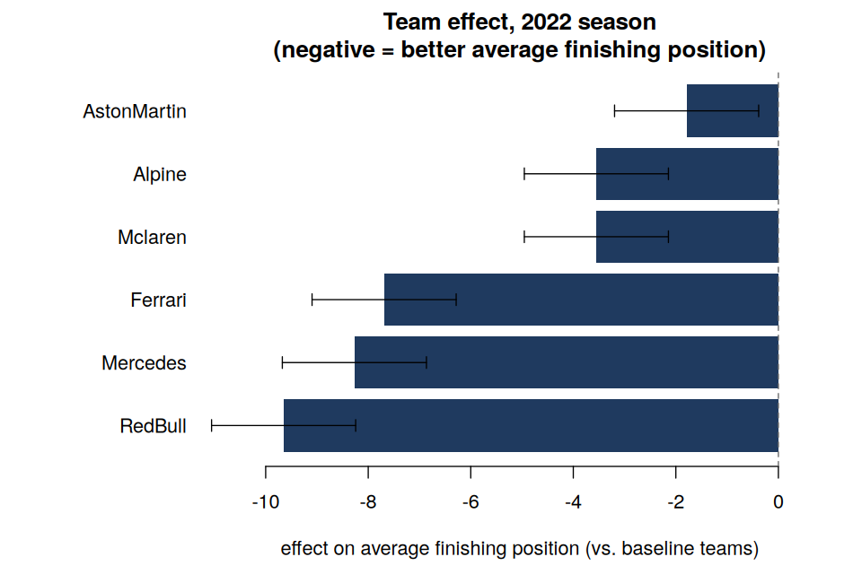

::: {.project-detail-hero}

Archive · Superseded F1 overview

# Faster identification of faster F1 drivers

The compact overview used during the dual-page redesign, retained as a visible backup after the richer industry-facing post became canonical.

Silvio Fanzon
University of Hull

<a class="project-primary-action" href="../f1-time-rank-duality/index.qmd">Open current project →</a>
<a href="https://www.silviofanzon.com/F1-Paper-Code/">Technical walkthrough</a>
<a href="https://doi.org/10.1016/j.econlet.2024.111671">Paper</a>

:::

::: {.callout-warning appearance="simple"}
**Archived version.** This is the shorter overview that preceded the current industry-facing page. The [current project](../f1-time-rank-duality/index.qmd) contains the corrected two-dataset explanation and the additional R-generated figures.
:::

::: {.project-evidence-strip}

<strong>Output</strong>Economics Letters, 2024

<strong>Data</strong>2022 season results and bookmaker odds

<strong>Method</strong>Probability, regression and time–rank duality

<strong>Implementation</strong>Annotated, reproducible base-R workflow

:::

::: {.project-role-note}
This project presents joint work with John Fry and Tom Brighton. I am a co-author of the paper; the linked repository contains the companion code, data and reproducibility material.
:::

::: {.headline-box}
**The headline result:** using just one season of publicly available race
results, the paper identifies **Max Verstappen** and **Fernando Alonso**
as performing better than their cars alone would predict — a separation
of driver skill from car performance that previously needed several
seasons of data to establish.
:::

## The problem {data-nav-title="The problem"}

In Formula 1, the car matters enormously. So when a driver wins, how much
of that is the driver, and how much is the car? Untangling the two has
historically taken **years** of data, because car and driver performance
are so entangled within a single season.

## Two ways to model a race, and a useful link between them {data-nav-title="Two race models"}

There are two natural ways to model who wins a race:

1. **Model finishing *times*.** Treat each car's finishing time as random
   (specifically, exponentially distributed). This gives clean, closed-form
   formulas for win probabilities — but it needs data that's rarely public,
   since cars that get lapped don't complete the full race distance, so
   real finishing times usually aren't recorded.
2. **Model the final *rank* directly**, via regression. This works with
   the rank data that's actually publicly available (everyone knows who
   finished where), but on its own it's more of a black box.

The paper's contribution is showing these two approaches are mathematically
**equivalent** — a "time-rank duality." That equivalence means you get the
clean theoretical structure of the time-based model while only ever needing
the rank data everyone already has.

  
01<strong>Race odds</strong><small>Calibrate latent time rates</small>

  
02<strong>Time–rank duality</strong><small>Translate probabilities into expected ranks</small>

  
03<strong>Season regression</strong><small>Estimate constructor and teammate effects</small>

  
04<strong>Driver comparison</strong><small>Identify gaps beyond the car-only benchmark</small>

## Using it to separate driver from car {data-nav-title="Driver vs car"}

Applied to the 2022 season, the rank-based side of this duality becomes a
regression: final race position, explained by which team a driver was in
plus a flag for which of the two teammates is typically considered the
team's "second" driver.

{width="85%" fig-align="center" fig-alt="Horizontal coefficient plot showing estimated Formula 1 constructor effects for the 2022 season."}

This effectively measures each team's car: Red Bull's average finishing
position in 2022 was about 9.65 places better than the slowest teams on the
grid, Mercedes about 8.27, and so on.

The clever next step: if performance were *purely* about the car, a team's
two drivers should occupy two consecutive finishing positions, on average —
the better car's drivers placing just ahead of the next-best car's drivers.
A teammate beating their teammate by **more than about one position**, on
average, is therefore a sign of real driver skill, beyond what their car
alone would produce. The paper estimates the threshold from the 2022 season and applies it to
the 2023 Qatar odds-implied expected ranks. Two drivers clear the bar:
**Max Verstappen** and **Fernando Alonso**.

::: {.callout-note appearance="simple"}
The [technical walkthrough](https://www.silviofanzon.com/F1-Paper-Code/) distinguishes the regression and confidence interval that are reproduced exactly from the more delicate driver-level comparison discussed in the paper. It also records an inconsistency discovered while independently checking that example.
:::

## Why this matters {data-nav-title="Why this matters"}

The practical contribution isn't really about F1 specifically — it's a
general recipe for separating an individual's contribution from the
"vehicle" (team, tool, platform) they operate within, using less data than
was previously thought necessary, by combining two different but
mathematically linked ways of modelling the same outcome.

