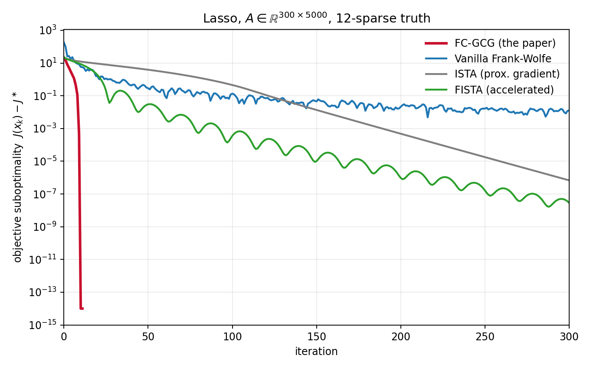
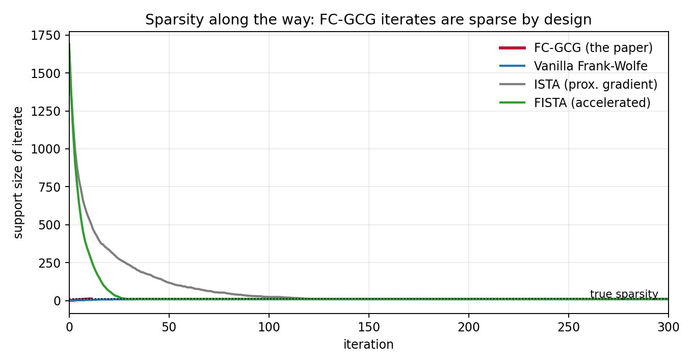
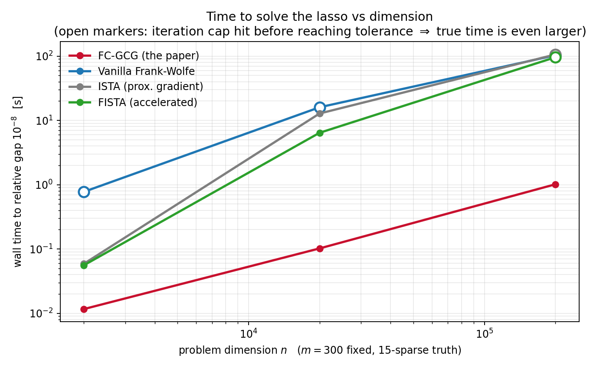

Companion post to [*Asymptotic linear convergence of fully-corrective generalized conditional gradient methods*](https://doi.org/10.1007/s10107-023-01975-z) (Bredies, Carioni, Fanzon & Walter, *Mathematical Programming*, 2024 — open access). The linked Python repository is a **pedagogical lasso implementation created to explain and test the paper's ideas**; it is not the original research code used to produce the theoretical paper. Code and experiments: [github.com/sfanzon/sparse-gcg-paper-explainer](https://github.com/sfanzon/sparse-gcg-paper-explainer).

## The problem, without the Banach spaces {data-nav-title="The problem"}

A huge amount of modern applied maths boils down to problems of the shape

$$\min_u \;\; \underbrace{F(Ku)}_{\text{fit the data}} \; + \; \underbrace{R(u)}_{\text{keep it simple}}$$

Reconstructing an MRI image from too few measurements, locating point sources from sensor data, training a sparse regression model — all instances. The regularizer $R$ encodes a preference for *simple* solutions, and for a large family of regularizers "simple" means **sparse**: the solution is a combination of a handful of elementary building blocks, or *atoms*.

Here is the key geometric fact the paper is built on. The atoms are not arbitrary — they are the **extremal points of the unit ball of $R$**: the "corners" of the ball, the points that cannot be written as averages of other points in it. And there's a classical lemma that makes them algorithmically accessible: *a linear function on a ball is always maximised at an extremal point*. So if you can maximise linear functions over the ball — one cheap operation — you can discover atoms one at a time.

Our algorithm, **FC-GCG** (fully-corrective generalized conditional gradient), does exactly that, alternating two steps:

1. **Insertion.** Look at the current residual, ask *"which single atom correlates best with what's still unexplained?"* — a linear problem, solved at an extremal point — and add that atom to your working set.
2. **Full correction.** Re-optimise the objective over combinations of *only* the atoms collected so far. This is a low-dimensional convex problem — cheap, because your working set is small — and it also discards atoms that turn out to be useless.

Two properties fall out immediately. Iterates are sparse **at every iteration**, by construction — sparsity is not something you converge towards, it's the data structure. And the algorithm can **stop with a certificate**: if no atom correlates with the residual above the threshold set by $R$, the optimality conditions hold exactly.

What the paper proves: the method always converges at the classical Frank–Wolfe rate $O(1/k)$, and — this is the hard part, and the reason the paper is 68 pages — under a natural non-degeneracy condition on the dual variable, convergence is eventually **linear**: the error shrinks geometrically. The proof lifts the problem to a space where the atoms become coordinates, which is also a decent mental model for the algorithm itself.

## The whole idea on one example: the lasso {data-nav-title="The lasso example"}

Everything above lives in infinite-dimensional Banach spaces in the paper. But you can watch every gear turn in the most familiar sparse problem there is — the **lasso** in $\mathbb{R}^n$:

$$\min_x \;\tfrac12 \lVert Ax - b\rVert^2 + \lambda \lVert x \rVert_1 .$$

The unit ball of $\lVert\cdot\rVert_1$ is the cross-polytope, and its extremal points are simply the $2n$ signed coordinate vectors $\pm e_i$. So the abstract algorithm becomes something you could explain to a first-year student:

1. **Insertion:** compute the correlations $p = A^\top(b - Ax_k)$ of each column with the residual; pick the column with the largest $|p_i|$. If $\max_i |p_i| \le \lambda$: **stop — you are exactly optimal.**
2. **Full correction:** solve the lasso *restricted to the columns picked so far* — a problem in 5, 10, 15 variables instead of $n$ — and drop columns whose coefficient is zero.

If this reminds you of matching pursuit: yes — FC-GCG is the convex, certificate-carrying relative of greedy methods, and in the general Banach setting it's the algorithmic engine behind "grid-free" approaches to inverse problems.

## Racing it: FC-GCG vs Frank–Wolfe vs gradient descent {data-nav-title="FC-GCG comparison"}

The natural baselines are **vanilla Frank–Wolfe** (same insertion oracle, but instead of re-optimising it just averages the new atom in with step size $2/(k+2)$) and **proximal gradient descent** (ISTA, plus its accelerated version FISTA) — the workhorse "gradient descent for sparse problems". We race them on a lasso with $A \in \mathbb{R}^{300\times 5000}$ and an 11-atom solution:

{fig-alt="Log-scale convergence plot comparing FC-GCG, Frank-Wolfe, ISTA and FISTA objective suboptimality over iterations."}

The qualitative gap is exactly what the theory predicts. Frank–Wolfe's averaging step is what caps it at $O(1/k)$ — it keeps diluting good atoms with step-size bookkeeping and zig-zags near the solution. ISTA converges linearly but slowly. FC-GCG does something the plot renders almost violent: **one insertion per solution atom, then done, at machine precision** — the "fully-corrective" step means an atom, once found, is used *optimally* forever.

There's a second story in the *support size* of the iterates:

{fig-alt="Plot comparing the support size of FC-GCG, Frank-Wolfe, ISTA and FISTA over iterations."}

ISTA and FISTA wander through hundreds of nonzeros before settling; FC-GCG never holds more atoms than the answer needs. In $\mathbb{R}^n$ that's an aesthetic point. In the infinite-dimensional problems the paper actually targets, it's the whole point — off a grid, a "dense iterate" doesn't even exist, while "a list of a few atoms" is a perfectly good data structure.

## Where it pays: high dimensions {data-nav-title="High dimensions"}

All four methods pay the same $O(mn)$ per iteration — one sweep of the data to compute a gradient or dual variable. So wall-clock time is decided by *how many iterations you need*, and FC-GCG's count is essentially the number of atoms in the solution, **independent of the ambient dimension**:

{fig-alt="Log-scale timing plot comparing FC-GCG, Frank-Wolfe, ISTA and FISTA as problem dimension increases."}

At $n = 200{,}000$ the difference is orders of magnitude — not because FC-GCG’s iterations are cheaper (they’re marginally *more* expensive — each includes a tiny inner solve), but because it takes ~15 of them where the baselines take thousands. Concretely, at $n=200{,}000$: **1 second for FC-GCG versus 96–106 seconds** for FW/ISTA/FISTA — with all three baselines *still short* of the target accuracy when their iteration caps hit. This is the regime the method was designed for: in our [companion work on dynamic MRI](https://doi.org/10.1007/s10208-022-09561-z), the "dimension" is a continuum — atoms are curves of moving point sources — and building solutions atom-by-atom is not an optimisation trick but the only viable representation.

**Fine print, in fairness.** The lasso instance here is deliberately easy — well-conditioned Gaussian designs satisfy the paper's non-degeneracy assumptions comfortably, which is what makes the convergence so clean. And specialised lasso solvers (coordinate descent with screening rules) are also very fast on this problem; the comparison above is between *general-purpose* first-order schemes, which are the ones that generalise to the measure-space setting.

## The three ideas worth stealing {data-nav-title="Three takeaways"}

Even if you never touch a Banach space, the design principles travel:

1. **Match your data structure to your prior.** If you believe the answer is sparse, iterate over *lists of atoms*, not dense vectors.
2. **Certificates beat convergence.** A stopping rule of the form "no atom correlates above $\lambda$" is an exact optimality proof, not a heuristic tolerance.
3. **Spend compute where it compounds.** The fully-corrective step looks expensive per iteration but slashes the iteration count — the classic trade of a cheap outer loop for a smart inner one.

*Paper (open access): [doi:10.1007/s10107-023-01975-z](https://doi.org/10.1007/s10107-023-01975-z) · Code: [github.com/sfanzon/sparse-gcg-paper-explainer](https://github.com/sfanzon/sparse-gcg-paper-explainer)*

## Citation and licence {#citation data-nav-title="Cite & reuse" .unnumbered}

If the paper or companion code is useful in your work, please cite the published article [@gcgpaper]. The maintained code is available at [sfanzon/sparse-gcg-paper-explainer](https://github.com/sfanzon/sparse-gcg-paper-explainer) [@gcgrepo]. Code and data are released under [CC BY-NC 4.0](https://creativecommons.org/licenses/by-nc/4.0/).

```bibtex
@article{2024-Bre-Car-Fan-Wal,
  author  = {Bredies, Kristian and Carioni, Marcello and Fanzon, Silvio and Walter, Daniel},
  title   = {Asymptotic linear convergence of Fully-Corrective Generalized Conditional Gradient methods},
  journal = {Mathematical Programming},
  volume  = {205},
  pages   = {135--202},
  year    = {2024},
  doi     = {10.1007/s10107-023-01975-z}
}
```

## References {.unnumbered}

::: {#refs}
:::
